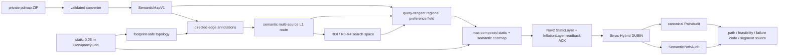

# PLN-02 static semantic A2B architecture 2A-V2

## Identity and scope

- `architecture_id`: `2A-V2`
- `implementation_revision`: `r0`
- `parent_architecture`: `2A-V1-r2-roi-pathaudit-v1`
- map resolution: exactly `0.05 m/cell`
- platform: Jackal footprint `[[0.255,0.215],[0.255,-0.215],[-0.255,-0.215],[-0.255,0.215]]`
- motion: forward-only, no in-place rotation, minimum turning radius `0.40 m`, maximum curvature `2.50 1/m`
- environment: static map, `dynamic_obstacles=false`

The parent is the formally delivered static 2A-V1-r2 implementation. 2A-V2 retains its canonical PathAudit, topology-to-ROI data flow and Smac Hybrid/DUBIN L3 planner, then adds a shared semantic map, semantic L1 edge costs, query-conditioned regional L3 preferences, semantic readback ACK and a separate SemanticPathAudit.

The repository also contains `2D-V1-r3-dynamic-incremental`, but it is not a parent or dependency of this implementation. 2A-V2 does not import the dynamic replay/snapshot pipeline, restore Collision Monitor, process live obstacles, perform SLAM/localization, or control a robot.

## Data flow



L1 and L3 use the same `semantic_map_hash`. Every persisted directed edge also records the base-map, semantic-map, policy and topology hashes that produced it.

## SemanticMapV1

The versioned JSON intermediate contains:

- map frame, resolution, origin, width and height;
- source pdmap SHA-256 and a canonical semantic-map hash;
- polygon, line or point geometry in world coordinates;
- semantic class and stable semantic id;
- independent `hard`, `soft` and `non_stopping` flags;
- direction rule, priority, source field and source properties;
- conversion diagnostics, unrecognized fields and traffic-rule metadata.

The converter reads `ATLAS_DATA` and `optemap.yaml` from either the ZIP or a private extracted directory. It validates closure, non-zero area, self-intersection and map bounds; invalid/empty/outside polygons are diagnosed instead of silently trusted, and partial polygons are clipped. Rasterization explicitly maps world Y to the bottom-origin ROS map and then to the top-origin PGM row, matching `HospitalMap.world_to_cell()`.

Polygon vertex order is never interpreted as travel direction. `right_hand_drive=true` is retained only as traffic-policy metadata. With no explicit per-lane direction in this pdmap, lane direction comes from the selected query's L1 route tangent.

## Class behavior and overlap

| Class | L1 | L3 | Endpoint rule |
|---|---|---|---|
| `forbidden`, `no_go` | block on footprint/safety overlap | lethal `254` | illegal |
| `no_stopping` | traversable | non-lethal | goal/task end rejected |
| `junction_area` | small semantic cost | neutralize and smoothly taper lateral preference | legal if otherwise free |
| `lane` | preferred over unlabelled | query-relative keep-right | legal if otherwise free |
| `parking_area` | soft semantic cost | medial-axis/clearance keep-center with goal taper | legal outside no-stopping |
| `speed_bumps` | additive soft cost | additive soft cost | legal; speed control is out of scope |
| `fence_area` | diagnostic only | non-lethal | meaning was not explicit enough to classify as a wall |
| unlabelled | base length plus configured unlabelled cost | no lateral preference | base-map rules |

Lateral overlap priority is `forbidden/no_go > junction neutralization > task-target parking center > lane keep-right > unlabelled`. Speed-bump cost remains independently additive and can never replace a lethal cell. Static-map costs are composed with `max`, so semantics cannot clear an existing obstacle.

`no_stopping` is a global-planning endpoint constraint. It does not claim that a downstream controller can never pause transiently while traversing such a region.

## Direction-conditioned lateral preference

For each query, the selected L1 polyline supplies a local tangent. The world-frame right normal is derived from that tangent, so reversing the same query automatically reverses its right side. Junctions and low-stability tangents taper the preference rather than inventing a lane direction.

The lane target is `0.40 m` from robot base center to the right polygon boundary. It is not body-edge clearance. The complete footprint plus semantic safety margin remains the hard collision model.

Parking preference uses connected-area medial clearance and normalized deviation from the medial maximum. It tapers to zero near a legal task goal so an off-center target remains reachable. Connected-component distance transforms are limited to their bounding boxes; this preserves the definition without multiplying full-map work when an ROI fragments a parking polygon.

## Costs and caching

Directed L1 edges use:

```text
C_edge = length + semantic_integral + zone_entry_penalty + direction_penalty
```

Each annotation stores semantic region ids, coverage length, direction relation, individual cost terms, blocking reason and a key over base-map hash, semantic-map hash, policy hash, topology hash, edge id and traversal direction. Both directions are precomputed before online requests. Endpoint alternatives use one multi-source/multi-target semantic Dijkstra rather than repeated pairwise searches.

L3 uses:

```text
C_soft = clamp(w_class*C_class + w_lateral*C_lateral
               + w_transition*C_transition, 0, 252)
```

Internal soft values `0..252` are mapped to OccupancyGrid `0..99`; `100` is reserved for hard occupancy. The pinned Humble StaticLayer reads `trinary_costmap`, `lethal_cost_threshold` and `unknown_cost_value` from the parent costmap namespace, so the generated Nav2 file sets both that scope and the plugin scope. The active parameter must be `trinary_costmap=false`.

The effective Nav2 inscribed radius is `0.225 m`: Jackal's `0.215 m` geometric radius plus the pinned costmap's default `0.010 m` footprint padding.

## Semantic costmap ACK

Publication evidence includes publication version, ROI sequence, policy hash, expected occupancy-grid hash, expected full-map master hash, server timestamp and server-content hash.

- every hard or published-100 affected cell must read back exactly `254`;
- every effective soft cell must be non-lethal and no lower than its exact non-trinary StaticLayer mapping;
- it must not exceed the deterministic full-map `max(static, inflation)` value;
- exact soft-master mismatches are counted separately even when they remain inside those bounds.

The interval is necessary because pinned Humble incrementally recomputes InflationLayer within changed bounds; a small number of boundary cells can have a lower decay shell than a fresh full-map Euclidean inflation. This is not treated as message receipt: `trinary_costmap=true`, dropped soft updates, under-mapped soft values, stale excessive inflation and every hard mismatch all fail ACK and trigger the existing full-publication repair path.

## Preference relaxation

| Level | Change from the preceding strict request |
|---|---|
| R0 | complete regional preference, base ROI |
| R1 | reduce only lateral weight to `0.35` |
| R2 | also disable lateral preference only in detected narrow channels, endpoint neighborhoods and junction transitions |
| R3 | expand ROI padding from `2.0 m` to `4.0 m` |
| R4 | full-map Smac while preserving every hard semantic and motion invariant |

Strict mode sets `preference_relaxation.enabled=false` and executes only R0. Every attempt records trigger reason, preceding failure stage, relaxed parameters, hard-invariant state, final level and failure code.

No level relaxes static/lethal obstacles, footprint checks, legal endpoints, no-stopping goals, forward-only motion, no in-place rotation, minimum radius or maximum curvature.

## Audits and failure codes

Canonical PathAudit remains the authority for static-footprint and kinematic validation. Independent SemanticPathAudit adds forbidden-footprint overlap, no-stopping goal status, lane distance/error/correct-side ratio, parking P50/P95 normalized deviation, junction discontinuity, explicit-direction wrong-way distance, relaxation distance, per-region path length, per-source path length and path-length increment against the no-semantics arm.

Accepted paths require zero collision, kinematic, hard-semantic and no-stopping-goal violations. Semantic-specific failures include `HARD_SEMANTIC_ENDPOINT`, `NO_STOPPING_GOAL_VIOLATION`, `HARD_SEMANTIC_FOOTPRINT_CONFLICT`, `HARD_SEMANTIC_VIOLATION`, `EXPLICIT_DIRECTION_VIOLATION` and `HARD_CONSTRAINT_VIOLATION`. L1/L3/Smac failures retain the parent's explicit codes such as endpoint-out-of-bounds, endpoint-not-attachable, no-route, no-path, maximum-iterations, timeout and backend-unavailable.

## Real pdmap conversion

The private source is ignored by Git at `private_data/pudu_wanda_3f/`. Its conversion is not embedded in tests or public documentation. The converter-derived inventory is 8 lanes, 11 junction areas, 10 parking areas, 14 fence areas, 20 speed-bump areas and 1 forbidden element. All 14 fences remain diagnostic/non-lethal; all 8 lanes use query-derived direction; 5 polygons were clipped to map bounds; no unrecognized fields were found.

Private conversion evidence:

- `private_data/pudu_wanda_3f/results/conversion_v1/semantic_map_v1.json`
- `private_data/pudu_wanda_3f/results/conversion_v1/conversion_report.json`
- `private_data/pudu_wanda_3f/results/conversion_v1/semantic_overlay.png`

## Tests and experiment evidence

The synthetic fixture contains no real coordinates. It covers forward/reverse keep-right, junction taper/restore, parking center/endpoint taper, forbidden and no-stopping behavior, R1/R2/R4 invariants, static max composition, non-trinary soft mapping, ACK checks, PGM Y inversion, overlap priority, cache invalidation and lack of polygon-order direction inference.

The real query-set artifact validates all eight requested intents and records footprint safety, topology component, endpoint semantics and purpose checks. Private A/B results are written to a fresh result directory with `runs.csv`, `summary.json`, `summary.csv`, `protocol.json`, `semantic_edges.json`, per-path JSON, ROS logs, ACK traces, report and overlay. Historical mentor-map r2 values remain in the r2 delivery document and must not be presented as a percentage improvement over this different map.

### Formal private-map run

`real_ab_r0_run12` is the formal run against the converted private map and the current r0 code. It contains one measured pass over eight deterministic query intents per arm, with no warm-up sample included in the statistics.

| Metric | A: semantics disabled | B: semantics enabled |
|---|---:|---:|
| accepted paths / requests | 5 / 8 | 5 / 8 |
| success rate | 62.5% | 62.5% |
| online wall time P50 / P95 | 1777.8 / 3450.4 ms | 12484.9 / 18283.6 ms |
| planner time P50 / P95 | 267.3 / 527.6 ms | 309.3 / 866.8 ms |
| accepted path length P50 / P95 | 155.87 / 172.55 m | 157.64 / 164.90 m |
| accepted-path curvature P95 distribution, P50 / P95 | 0.512 / 0.584 1/m | 0.516 / 1.068 1/m |
| final costmap ACKs | 8 / 8 | 8 / 8 |
| hard / soft-bound ACK mismatches | 0 / 0 | 0 / 0 |
| relaxation-trigger rate | 0% | 100% |
| peak RSS | 975.6 MB | 1008.8 MB |

Both arms had three `SMAC_MAX_ITERATIONS` failures. All accepted paths had zero static collision, kinematic, hard-semantic and no-stopping-goal violations. B-arm successes finished at R2 (2), R3 (2) and R4 (1); this means r0 preserved hard safety but did not demonstrate strict-preference robustness. Its accepted-path lane correct-side-ratio distribution was P50 `0.505`, P95 `0.951`; parking normalized-deviation P50 distribution was P50 `0.542`, P95 `0.845`. A-arm lateral metrics are deliberately `null`, not zero, because semantic auditing is disabled in that control arm.

The B arm recorded 5,861,699 final exact-soft-master differences while recording zero soft-bound failures. These are reported, not hidden: the values remained between the exact non-trinary StaticLayer lower bound and a deterministic fresh full-map static/inflation upper bound, as required by the ACK protocol above. Across all B attempts and repair publications, 42 ACKs succeeded, with zero hard and zero soft-bound mismatch; rejected pre-repair publications remain in the failure trace.

This single-map run therefore establishes implementation feasibility and hard-invariant preservation, not a performance improvement. The one-time directed-edge semantic precomputation took 9372.1 ms before online requests and is excluded from both per-query L1 and wall time; regional preference generation is excluded from the very small cached L1 timings but included in per-query wall time. The B arm's wall time, universal relaxation, weak reverse-query correct-side behavior and unchanged aggregate success rate are explicit r0 performance risks for follow-up work.

Formal evidence is under `private_data/pudu_wanda_3f/results/real_ab_r0_run12/`. The overlay was visually checked against the rasterized semantics and base map; paths showed no obvious static-obstacle or forbidden-region conflict. Numeric footprint audits remain the acceptance authority.

## Reproduction

From a clean terminal:

```bash
cd /home/robot/pudu_robot_ws
export EVAL_SRC=/home/robot/pudu_robot_ws/external/arena4_ws/src/arena/evaluation/arena_evaluation
export PYTHONPATH="$EVAL_SRC:${PYTHONPATH}"

python3 -m arena_evaluation.two_layer_v2_semantic_benchmark --help
python3 -m arena_evaluation.pdmap_semantic_converter --help

python3 -m arena_evaluation.two_layer_v2_semantic_benchmark \
  --mode convert \
  --pdmap /home/robot/pudu_robot_ws/private_data/pudu_wanda_3f/source/LTMjMTEjMDcwNl8yd_S4h_i_vi0z5qW8.pdmap \
  --output-dir /home/robot/pudu_robot_ws/private_data/pudu_wanda_3f/results/conversion_NEW

python3 -m arena_evaluation.two_layer_v2_semantic_benchmark \
  --mode synthetic-smoke \
  --output-dir /home/robot/pudu_robot_ws/private_data/pudu_wanda_3f/results/synthetic_NEW

source /opt/ros/humble/setup.bash
cd /home/robot/pudu_robot_ws/external/arena4_ws
colcon build --packages-select arena_evaluation --symlink-install
source /home/robot/pudu_robot_ws/external/arena4_ws/install/setup.bash
cd /home/robot/pudu_robot_ws
/home/robot/pudu_robot_ws/external/arena4_ws/src/arena/arena-rosnav/.venv/bin/python -m pytest -q \
  "$EVAL_SRC/test/test_two_layer_v1_r2_roi_pathaudit.py" \
  "$EVAL_SRC/test/test_unified_four_backends_smoke.py" \
  "$EVAL_SRC/test/test_l1_l3_corridor_hybrid_smoke.py" \
  "$EVAL_SRC/test/test_l1_l3_cache_optimization.py" \
  "$EVAL_SRC/test/test_two_layer_v2_semantic.py"

ros2 run arena_evaluation two_layer_v2_semantic_benchmark \
  --mode real-ab \
  --config "$EVAL_SRC/config/two_layer_v2_semantic.yaml" \
  --extracted-dir /home/robot/pudu_robot_ws/private_data/pudu_wanda_3f/extracted \
  --semantic-map /home/robot/pudu_robot_ws/private_data/pudu_wanda_3f/results/conversion_v1/semantic_map_v1.json \
  --topology-cache /home/robot/pudu_robot_ws/private_data/pudu_wanda_3f/results/real_ab_r0_run12/topology_cache \
  --output-dir /home/robot/pudu_robot_ws/private_data/pudu_wanda_3f/results/real_ab_NEW \
  --warmups 0 --repetitions 1 --ros-domain-id 224
```

Output directories are intentionally non-overwritable. Use a new suffix for every run, and keep DDS domain ids within the Fast DDS supported range `0..232`.

## Known limitations

- r0 is static-only and does not make claims about moving people or obstacle updates.
- There is no explicit single-lane direction in this pdmap; wrong-way distance therefore remains not applicable until such a field exists.
- Fence semantics are intentionally not lethal without source confirmation.
- Speed bumps affect route cost, not controller velocity.
- No-stopping applies to planned endpoints, not transient controller pauses.
- Real-map coordinates, source data, query files and screenshots remain private and ignored.
- The real experiment uses one pdmap-derived map and one deterministic eight-query set; it is not a multi-site generalization result.
