# [周报] PLN-02 A2B 全局规划基线与分层规划进展 - 李永祺

周报周期：2026-08-17 至 2026-08-21

**数据完整性检查结果：部分缺失。** Stage 5–8 的正式实验数据、协议、汇总 CSV、日志和绘图均已归档。当前仍缺少多地图、多规模评测、统一同进程端到端计时和 RRT*/Kinodynamic-RRT 对照；`queries_v2.yaml` 的校验字段及部分 manifest 字段仍需整理。

本周完成了 Hospital 静态地图上的 NavFn/Smac 基线、L1 拓扑与 L2 栅格组合、禁止原地旋转的 L3 局部 Hybrid 修复，以及靠中/靠边偏好评测。拓扑引导可减少搜索空间；硬运动学约束能够筛出无碰撞、无原地旋转和无硬半径违规的成功路径，但当前分层组合尚不能证明端到端加速。

# 1 本周进展

| 任务 | 状态 | 说明 |
|---|---|---|
| Hospital 0.05 m 静态地图基线复测 | 已完成 | 完成 NavFn A* 与 Smac Hybrid 四组配置，每组 50 条 measured 记录。 |
| L1 拓扑层与 L2 栅格层评测 | 已完成 | 完成全图 A*、拓扑引导 A* 及带回退模式对比。 |
| L3 硬运动学约束 | 已完成 | 禁止原地旋转，引入局部 Hybrid 修复并进行静态碰撞、曲率和拼接验收。 |
| 靠中/靠边横向偏好 | 已完成 | 完成权重扫描，选择 `center=1.0`、`right_edge=1.0`。 |
| 统一分层规划端到端计时 | 进行中 | Stage 8A 组合时间目前为估算值，尚未完成同进程实测。 |
| 多地图、多规模和 RRT* 对照 | 进行中 | 当前仅完成 Hospital 单地图，尚未形成完整适用边界结论。 |

# 2 关键结论与数据

## 2.1 基线与实验范围

| 项目 | 配置 |
|---|---|
| 地图 | Hospital 静态栅格地图，`1600 x 1600` 栅格，约 `80 x 80 m`，分辨率 `0.05 m/cell` |
| 起终点 | 10 对固定 query，固定随机种子 `20260821` |
| 机器人 | Jackal，矩形 footprint `0.51 x 0.43 m` |
| 运动学约束 | 最小转弯半径 `0.40 m`，最大曲率 `2.50 1/m`，禁止原地旋转 |
| 倒车 | 允许倒车，`reverse_penalty=2.0` |
| 搜索模型 | `REEDS_SHEPP` |
| 障碍物 | 仅静态障碍，不涉及动态障碍和局部控制 |

数据来源：[地图配置](./report_assets/inputs/hospital_005_map.yaml)、[固定 query](./report_assets/inputs/hospital_005_queries.yaml)、[规划协议](./report_assets/inputs/hospital_005_planner_protocol.yaml)、[拓扑协议](./report_assets/inputs/hospital_005_topology_protocol.yaml)。

## 2.2 系统输入输出

| 类别 | 当前系统内容 | 状态 |
|---|---|---|
| 输入 | 静态栅格地图、起点/目标位姿、Jackal footprint、运动学参数、横向偏好配置 | 已支持 |
| L1 输出 | 拓扑节点、通道序列、走廊约束 | 已实现并评测 |
| L2 输出 | 全图或走廊内的二维栅格路径 | 已实现并评测 |
| L3 输出 | 局部运动学修复路径、航向、可行性结果 | 已实现候选评测 |
| 评测输出 | 成功状态、静态碰撞、运动学违规、失败码、耗时、CPU、RSS/PSS、路径质量 | 已支持 |
| 当前缺口 | 统一端到端规划接口和同进程计时，多地图规模曲线，RRT* 对照 | 待完成 |

## 2.3 基线结果

| 基线 | `action_success` | `static_footprint_valid` | `final_valid_success` | Planning time P50/P95/P99 |
|---|---:|---:|---:|---:|
| NavFn Product | 50/50 | 50/50 | 50/50 | 10.156 / 12.066 / 13.934 ms |
| NavFn Normalized | 50/50 | 50/50 | 50/50 | 9.130 / 11.511 / 12.331 ms |
| Smac Product | 40/50 | 35/50 | 35/50 | 29.805 / 143.482 / 145.027 ms |
| Smac Normalized | 50/50 | 40/50 | 40/50 | 22.415 / 101.101 / 117.800 ms |

Smac 存在 action 成功但静态 footprint 无效的路径，因此最终结论使用 `final_valid_success`，不是单独使用 action 成功率。

数据来源：[Stage 5 基线汇总](./report_assets/tables/stage5_baseline_summary.csv)、[按 query 汇总](./report_assets/tables/stage5_baseline_by_query.csv)、[失败汇总](./report_assets/tables/stage5_failure_summary.csv)。

代表性基线图表（Stage 5，0.05 m）：

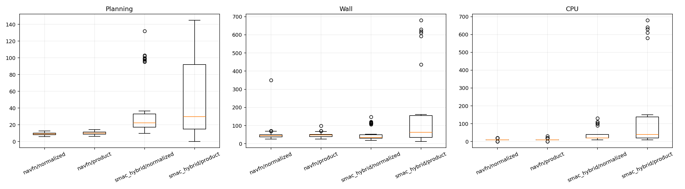

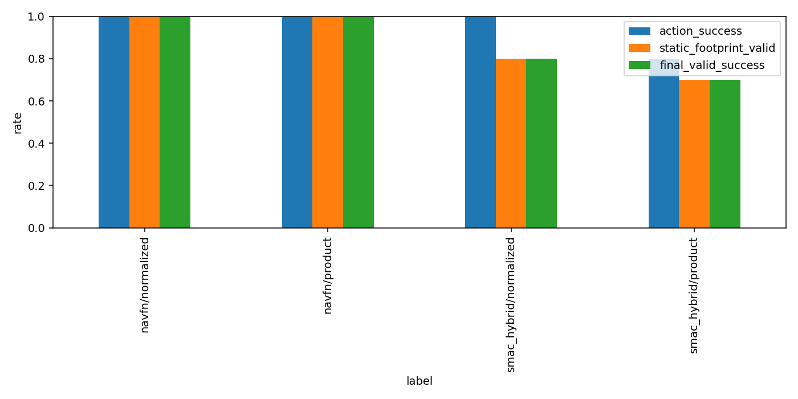

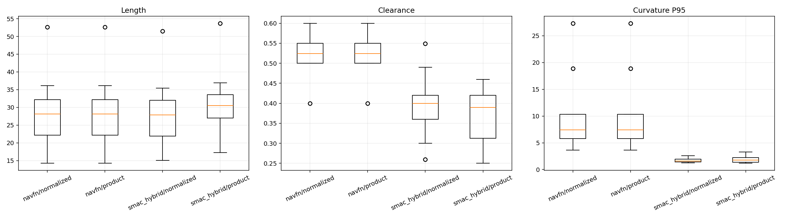

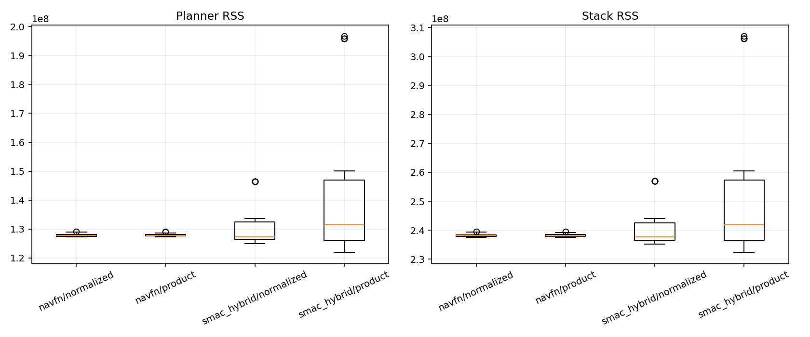

## 2.4 分层规划进展

| 层级 | 当前实现 | 评测结论 |
|---|---|---|
| L1 拓扑层 | 从静态地图提取拓扑通道并生成走廊约束 | 拓扑引导模式搜索节点减少 `42.55%` |
| L2 栅格层 | 全图 A* 或拓扑走廊内 A* | 纯拓扑引导在线 speedup `1.255x`；带回退为 `0.608x` |
| L3 运动学层 | 对航向跳变窗口调用局部 Hybrid 修复 | 禁止原地旋转后，成功路径满足静态碰撞和硬曲率约束 |

数据来源：[Stage 6 验收](./report_assets/tables/stage6_acceptance_summary.csv)、[Stage 6 对比](./report_assets/tables/stage6_comparison.csv)、[Stage 6 模式汇总](./report_assets/tables/stage6_summary_by_mode.csv)、[Stage 8A 验收](./report_assets/tables/stage8a_acceptance_summary.csv)。

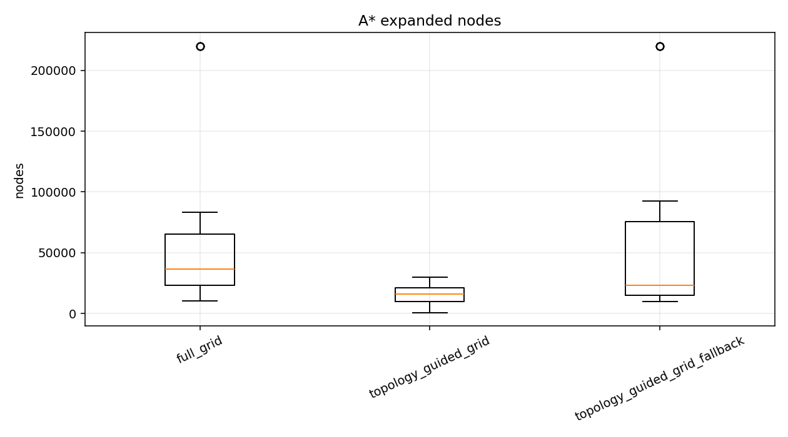

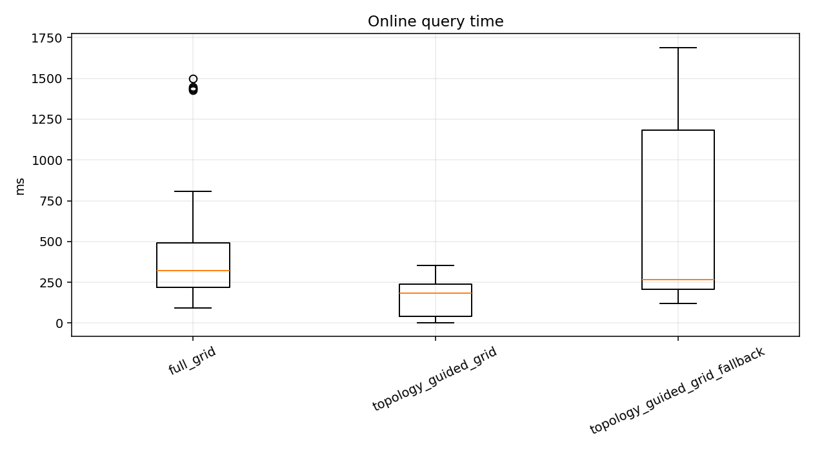

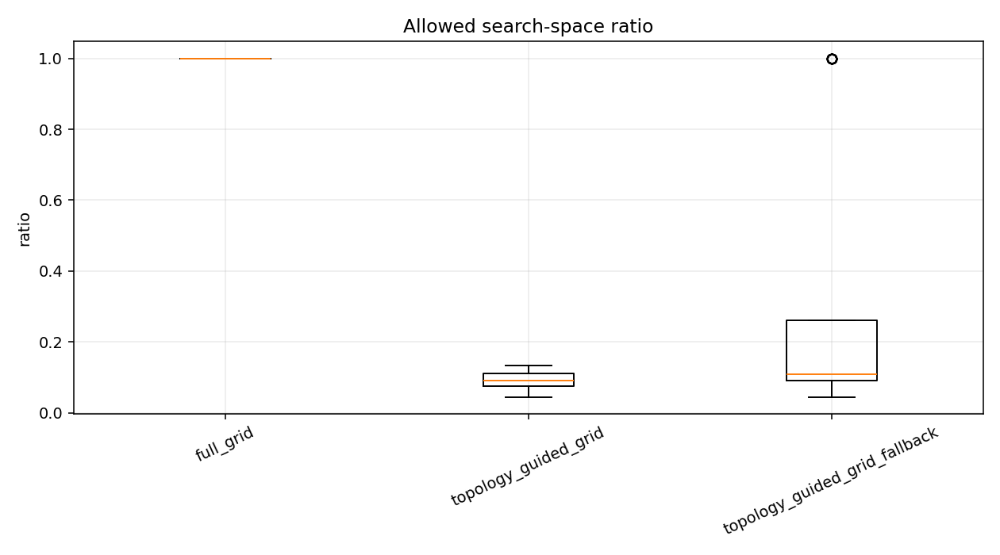

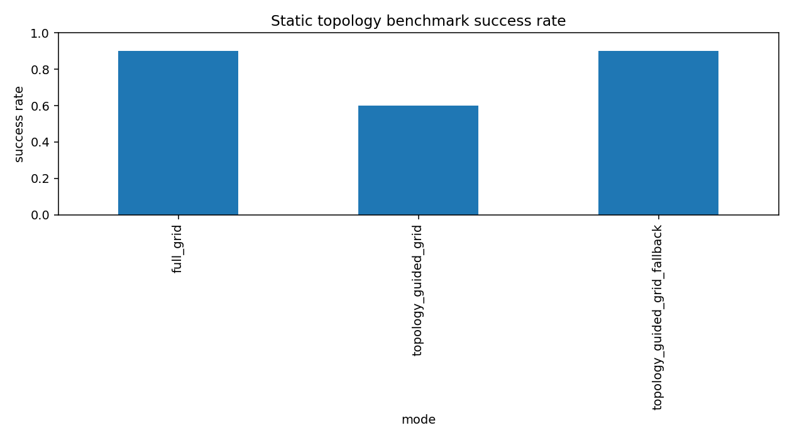

## 2.5 关键指标

### L1/L2 指标

- 拓扑预计算耗时：`7763.684 ms`；CPU 时间：`8588.354 ms`。
- 拓扑图：`224` 个节点、`195` 条边、`35` 个连通分量；文件大小 `879577 bytes`。
- 拓扑引导路径长度相对全图 A*：均值 `1.0042`，P95 `1.0145`。
- 带回退路径长度相对全图 A*：均值 `1.0175`，P95 `1.1321`。

数据来源：[Stage 6 对比](./report_assets/tables/stage6_comparison.csv)、[回退成本](./report_assets/tables/stage6_fallback_cost.csv)、[拓扑摊销](./report_assets/tables/topology_amortization.csv)。完整预计算记录仍保留在 [Stage 6 原始数据包](./data/layered_planner_benchmark/hospital_005/stage6_l1_l2/)。

### L3 硬约束指标

- 候选记录 `50` 条，最终有效 `35/50 = 70%`；同模型可达记录有效率 `35/45 = 77.78%`；query 级成功 `7/9`。
- 局部 Hybrid 调用 `100` 次，action 成功 `100/100`，通过静态和运动学复核 `75/100`。
- 成功路径原地旋转 `0`、静态碰撞 `0`、硬半径违规 `0`。
- 最小观测半径 `0.4397 m`，最大曲率 `2.2744 1/m`。
- 最大拼接位置误差 `0.0189 m`，最大拼接航向误差 `0.438°`。
- L3 planning time P50/P95/P99：`18.874 / 36.509 / 37.658 ms`；CPU P50 `20 ms`；RSS/PSS P50 约 `210.9 / 174.9 MiB`。

`q00`、`q08` 存在 `KINEMATIC_REPAIR_FAILED`；`q04` 保持 `STATIC_SEMANTICS_CONSERVATIVE_INFLATION_MISMATCH`，未进入 L3。组合时间是分段结果估算值，平均约为 full Smac 的 `22.79x`，不能作为端到端实测加速结论。

数据来源：[Stage 8A 验收](./report_assets/tables/stage8a_acceptance_summary.csv)、[性能汇总](./report_assets/tables/stage8a_performance_summary.csv)、[修复窗口汇总](./report_assets/tables/stage8a_repair_window_summary.csv)、[失败汇总](./report_assets/tables/stage8a_failure_summary.csv)。

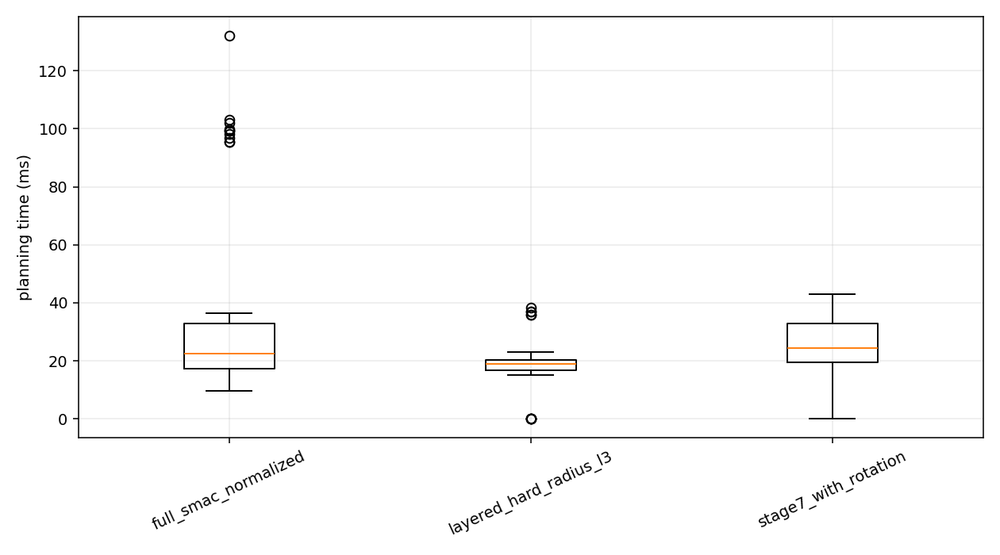

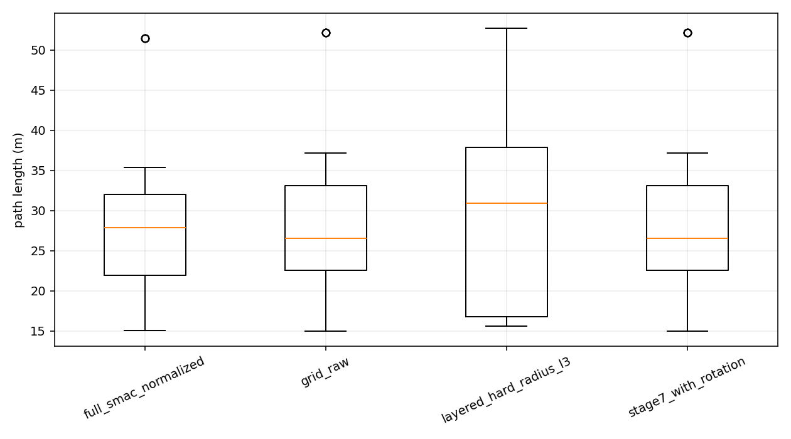

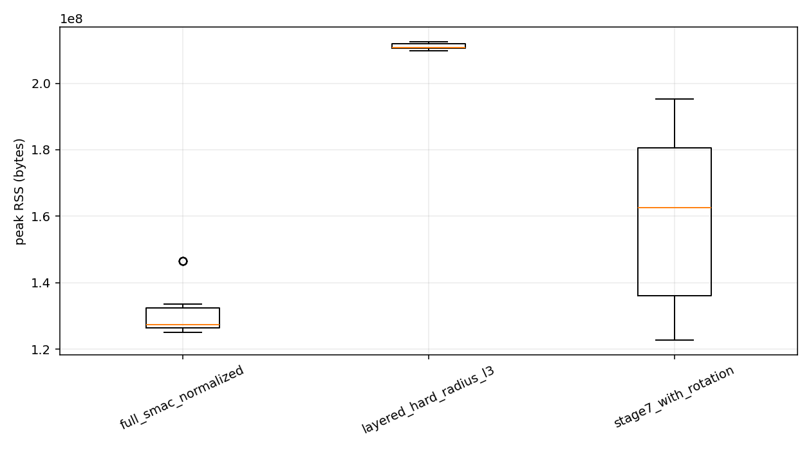

### 横向偏好指标

| 偏好 | 偏好效果 | 路径代价 | 性能变化 |
|---|---|---|---|
| Center | 中心偏差 `0.6551 -> 0.0778 m`，改善 `88.1%` | 路径均值增加 `3.85%`，P95 比值 `1.0597` | 展开节点增加 `12.4%`，在线时间增加 `25.2%` |
| Right edge | 目标侧墙误差 `1.0268 -> 0.2400 m`，改善 `76.6%` | 路径均值增加 `5.95%`，P95 比值 `1.1104` | 展开节点增加 `18.1%`，在线时间增加 `24.0%` |

最终权重：`center=1.0`、`right_edge=1.0`。两种偏好最终有效率均为 `35/50`，可达 query 均为 `7/9`；成功路径无静态碰撞和硬半径违规。

数据来源：[Stage 8B 验收](./report_assets/tables/stage8b_acceptance_summary.csv)、[选定权重对比](./report_assets/tables/stage8b_selected_comparison.csv)、[权重汇总](./report_assets/tables/stage8b_summary_by_weight.csv)、[选定权重](./report_assets/tables/stage8b_selected_weights.yaml)。

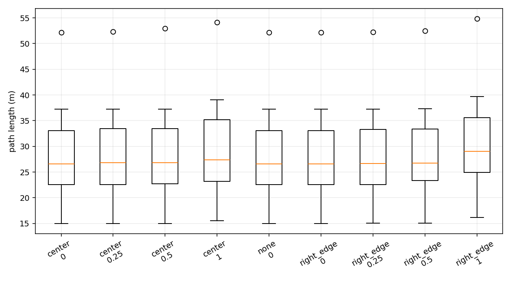

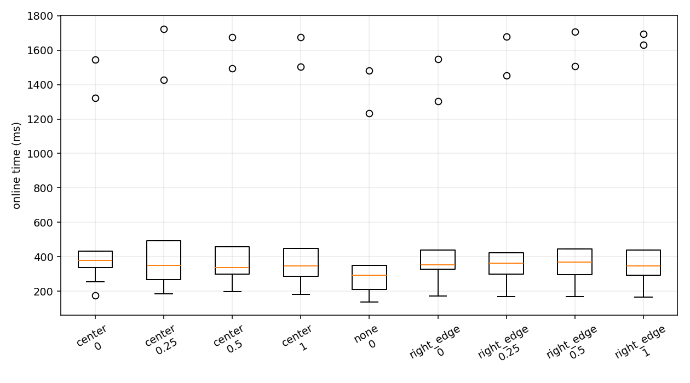

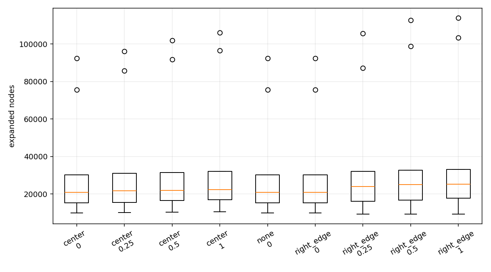

## 2.6 已验证结论与适用边界

### 已验证结论

- NavFn 在当前 Hospital 0.05 m 地图和固定 query 集上具有较高基线成功率和较低规划耗时。
- 拓扑走廊能够减少 L2 搜索空间；发生全图回退时，回退成本会抵消加速收益。
- 禁止原地旋转后，局部 Hybrid 修复可以生成满足静态碰撞和硬曲率约束的路径。
- Center 和 Right-edge 偏好能够改善横向位置误差，但会增加路径长度、搜索节点和在线耗时。

### 适用条件

- 结论仅适用于 Hospital 单张静态地图、`0.05 m/cell` 分辨率和固定 10 对 query。
- 使用固定 Jackal footprint、固定运动学参数和固定随机种子。
- 结果不代表多地图、多规模或动态环境下的性能。

### 遗留问题

- `q00`、`q08` 的局部 Hybrid 修复仍会失败。
- `q04` 存在拓扑静态语义与 Nav2 膨胀语义不一致问题。
- Stage 8A 组合耗时为估算值，不能作为端到端实测加速结论。
- 尚未完成多地图、多规模评测和 RRT*/Kinodynamic-RRT 对照。
- `queries_v2.yaml` 的校验状态和部分 manifest 字段仍需整理。

### 待导师确认

- 是否优先解决 `q00`、`q08` 的局部 Hybrid 修复失败。
- 是否将多地图、多规模和 RRT* 对照列为结题前必做项。
- 是否接受当前 Hospital 单地图结果作为阶段性基线结论。

# 3 阻塞项

无新增工程阻塞。`q00`/`q08` 修复失败、`q04` 静态语义差异、多地图规模评测和统一端到端计时列为遗留问题，不阻塞本周阶段成果整理。

# 4 下周计划

| 任务 | 目标 |
|---|---|
| 统一分层规划接口 | 统一 L1、L2、L3 的输入、输出、来源标记和失败码，形成可复现实验入口。 |
| 统一端到端计时 | 在同一进程内记录 L1、L2、L3 分段耗时及总耗时，区分实测值和估算值。 |
| L3 失败分析 | 针对 `q00`、`q08` 检查修复窗口、采样粒度和回退规则，不放宽原地旋转及硬半径约束。 |
| `q04` 语义问题分析 | 明确拓扑静态膨胀与 Nav2 costmap 语义差异，并保留结构化失败码。 |
| 静态地图扩展评测 | 在不引入动态障碍的前提下，补充合成走廊、多房间、门连接和多连通区域地图。 |
| 结题指标收口 | 汇总成功率、最终有效率、耗时、内存、路径长度、曲率和横向偏好满足度。 |

## 引用的数据与图表

报告筛选后的摘要数据、输入协议和代表性图表位于 [report_assets](./report_assets/)，便于导师直接查看；完整正式数据包仍位于本目录的 `data/` 下，包含 CSV、YAML 协议与 manifest、日志、路径压缩文件和 `plots/` 绘图。

筛选后的汇报材料：

- [代表性图表](./report_assets/figures/)
- [摘要表格](./report_assets/tables/)
- [地图、query 和协议](./report_assets/inputs/)

完整正式数据包：

- [Stage 5 planner benchmark](./data/planner_benchmark/hospital_005/)
- [Stage 6 L1/L2](./data/layered_planner_benchmark/hospital_005/stage6_l1_l2/)
- [Stage 7 历史消融](./data/layered_planner_benchmark/hospital_005/stage7_l3_kinematic/)
- [Stage 8A hard-radius L3](./data/layered_planner_benchmark/hospital_005/stage8a_hard_radius_l3_v2/)
- [Stage 8B lateral preference](./data/layered_planner_benchmark/hospital_005/stage8b_lateral_preference_v2/)
- [Hospital map package](./data/maps/hospital_005/)

补充分辨率对照图：[0.1/0.05 m 规划耗时对比](./report_assets/figures/resolution_time_comparison.png)。该图仅用于说明分辨率代价，不作为多分辨率算法结果。

**报告范围说明：** 本周报告和归档数据仅使用静态 Hospital 栅格地图进行 A2B 全局规划评测，未涉及动态障碍、局部控制、TEB/MPPI/DWB 或车辆实际运行过程。Stage 7 仅作为允许原地旋转的历史消融数据保留，正式车辆约束结果以 Stage 8A 为准。
