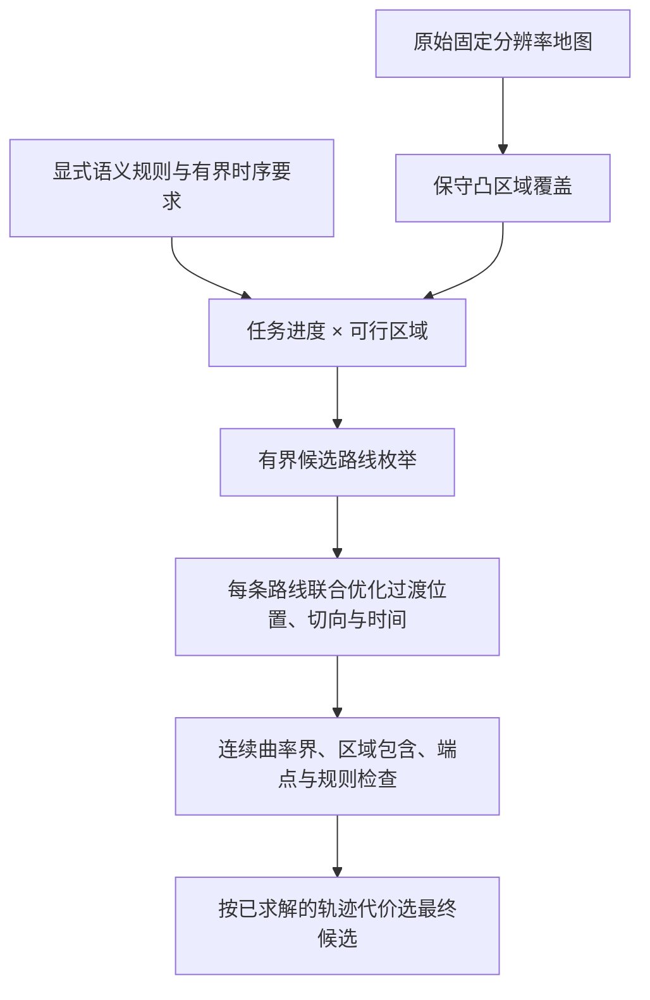

# STL-V0 独立研究主线

`architecture_id: STL-V0` · `implementation_id: stl-v0-r2` · **研究原型，非生产默认**。

这条主线研究：语义规则与可行空间集合共同决定路线，区域过渡位置、朝向和时间参与连续求解。规划核心不导入 3D、2A、旧分层规划器、Nav2 或 ROS；不读取骨架与历史路径，也没有回退到旧架构的分支。`COLCON_IGNORE` 保证它不进入现有默认 colcon 构建。

## r2 性能与分段优化

- 空间扫描索引生成与原始逐对判断等价的邻接，三类候选共享几何图；任务图状态按搜索需要生成。几何内存缓存最多保留两张图，缓存不含路线或轨迹。
- `real-preflight --cache-dir DIR` 保存按输入/算法哈希绑定的地图数组和精确查询/ROI 覆盖。缓存命中不会省略最终车体、曲率或语义检查。任意新起终点首次仍需构造覆盖；尚不是任意查询的整图分块预计算。
- 默认仅在全部基础候选失败后，对前两条路线尝试每区域两段曲线；共享原 30 s 请求预算，不放宽车体、转弯半径或端点。`--no-refine` 禁用此步骤，供保持候选不变的纯性能对照。
- 可行性恢复是已实现的实验选项，未成为默认策略；没有将失败状态包装成成功。

```bash
/home/robot/pudu_robot_ws/research/stl_v0/run_stl_v0 benchmark-r2 --out /tmp/stl-v0-r2-benchmark --repeats 3 --budget-s 30 --candidates 6 --maxiter 240
```

基准单独加载已冻结的 STL-V0-r1 源码作对照，不会作为生产回退；源代码快照需存在于实验目录。基准报告首次几何构图、命中几何缓存、失败后细分三种口径，进程启动和操作系统冷缓存不在计时内。r1 与 r2 的基础候选、有效性和目标值逐对核对；覆盖数组及区域完全一致。`study-r1` 仍是原先的消融实验入口，运行的是当前实现；重现历史 r1 必须使用其冻结源码快照。

## r1 新增能力

- 扫描补齐 ROI 内遗漏的安全像素，并桥接相邻安全像素所属的不同凸覆盖分量；再独立验证全覆盖与每条安全栅格邻接。该保证仅适用于保守安全栅格的四连通关系，不代表 SE(2) 轨迹完备。
- 增加平衡扩张区域、宽接口排序与宽区域候选；保留从原始栅格新生成的稀疏候选族，并纳入不限制宽度的修复覆盖候选，连续检查决定最终可行性。
- 图连接同时检查两侧语义半空间。联合优化与固定位姿消融共享投影后的语义可行初值。
- 真实车道局部规则实验使用冻结北行查询及原车道5几何，测试 0.35 m 靠右偏移与北行方向锥；这是明确命名的实验硬谓词，不等价于原始软 R2 偏好的完整实现。

一键执行覆盖复验、三次同进程重复、固定过渡位姿消融及真实车道对照：

```bash
/home/robot/pudu_robot_ws/research/stl_v0/run_stl_v0 study-r1 --out /tmp/stl-v0-r1-study --repeats 3 --budget-s 30 --candidates 6 --maxiter 240
```

`study-r1` 返回 0 表示实验执行完成，须读取 summary.json 判断各项通过情况。重复实验只在首轮绘图；协议记录是否生成图。重复性结论不代表冷启动、随机初值稳定性或多地图泛化。

单次 `plan` / `real-preflight` 可加 `--transition-mode joint|fixed_position|fixed_pose`。实图预检还可加 `--cover-mode legacy|repaired`，其中 legacy 仅指 STL-V0 自己的 r0 覆盖算法，不会调用旧架构。

## 1 运行

使用当前已具备 NumPy、SciPy、PyYAML、Pillow、Matplotlib 的系统 Python，命令可从任意目录运行。输出目录必须不存在。

```bash
/home/robot/pudu_robot_ws/research/stl_v0/run_stl_v0 plan   --scene /home/robot/pudu_robot_ws/research/stl_v0/scenes/right_band.json   --out /tmp/stl-v0-right-band-run1
```

真实地图默认读取冻结 selected8，不生成新起终点；`--query-ids` 仅抽取预检子集。

```bash
/home/robot/pudu_robot_ws/research/stl_v0/run_stl_v0 real-preflight   --workspace /home/robot/pudu_robot_ws   --out /tmp/stl-v0-selected8-run1   --budget-s 20 --candidates 6
```

```bash
cd /home/robot/pudu_robot_ws/research/stl_v0
/usr/bin/python3 -m pytest -q
```

CLI 返回码：`0` 表示当前研究检查通过（或仅准备完成）；`2` 表示没有通过的轨迹；`3` 表示输入／输出路径等被拒绝。`0` 不表示生产验收通过。

## 2 独立链路



- 每段使用三次 Bézier 曲线，其全部控制点约束在对应凸区域内。
- 邻段共享位置和物理速度，实现 C1 连续。接口不是固定采样位姿；位置及速度向量是变量，朝向由速度方向决定。
- 整数路线由任务乘积图中的稀疏覆盖、宽区域与不限制宽度三类有界 Yen 枚举处理，连续部分由 SLSQP 求解。几何图代价只用于候选排序，最终比较连续轨迹目标值。
- 这是 GCS 思路下的混合离散／连续研究实现，**没有实现论文的 GCS 凸松弛、通用 STL 编译或全局最优求解**。候选集与非凸优化均可能漏解。

## 3 支持的语义与时序片段

JSON `task` 支持：`horizon_s`、`always: safe`、`always: avoid_labels`、`ordered_eventually: [{label, window_s}]`。最终目标精确位姿在总时限内到达。事件时刻以进入所选语义区域的段起始时刻作见证，允许同一时刻完成同一区域包含的多个顺序义务；这是一个保守、有限片段，不支持通用 until、嵌套任意布尔公式或等待动作。

区域支持盒边界、附加线性半空间和前进方向锥。半空间约束全部 Bézier 控制点，方向锥约束全部速度控制点。未知字段和未知规则明确拒绝，不静默忽略。

内置 `right_band` 用显式半空间表达靠右带，`rule_route` 用禁用标签及按时访问标签改变路线。这些受控语义规则不等同于导师地图的原 R2 定义。

## 4 真实地图适配边界

- 读取原始 0.05 m 占据图、完整语义文件及冻结 selected8，检查图像／语义／查询哈希和坐标绑定。
- 以完整 padded 矩形车体的外接圆，外加像素方格与数值余量，保守构造可行中心区域；未知区和地图外不可通行。
- 矩形种子间距是覆盖算法参数，不改变地图分辨率，不平均像素，不建立地图金字塔。r1 补齐 ROI 内四连通安全像素的覆盖，但 ROI、保守膨胀与曲线表示仍可能遗漏合法通路。
- 静态硬障碍与可处理的禁行区域进入几何层；原始语义全部保存在结果中。尚未实现原 R2 的路线相关靠右、停车归一化净空及路径必要性验收，始终输出 `r2_semantic_acceptance: null`。
- 真实地图首版命令因此命名为 **real-preflight**，不能把其物理通过率称为完整语义规划成功率。

## 5 输出与检查

每个请求写入 `scene.json`、`protocol.json`、`result.json`、`path.json` 与 `trajectory.png`。结果包括所有连续候选尝试、优化前后接口、时间、完整控制点、曲率界检查和失败原因；真实地图额外执行原始栅格上的独立矩形车体 SAT 碰撞复核。

曲率通过 Bernstein 分子上界、导数盒下界与递归细分检查；无法界定时拒绝。检查基于浮点计算，不是带定向舍入的形式化验证工具。完整曲线位于保守凸区域的论证与密集车体复核分别保存。曲率上限 2.50 1/m、仅前进、禁止原地转向。

规划计时包含构图、候选枚举、连续求解与曲率检查；地图准备、矩形覆盖、独立车体复核、绘图分别处理。单次预检时延不能替代冷启动同轮性能对比；共享进程峰值 RSS 也不能解释成单请求增量内存。

## 6 参考与下一阶段

[STL–GCS，2026-05-22](https://arxiv.org/html/2605.23240v1) 为架构启发。论文未直接提供当前车辆完整非完整运动约束；本实现通过曲线切向、非零速度和曲率界另行处理。

下一阶段优先完成：可行空间覆盖的连通完整性、原 R2 语义谓词及独立验收、更多候选路线下的求解稳定性；在这些检查完善前不接入生产默认入口。
